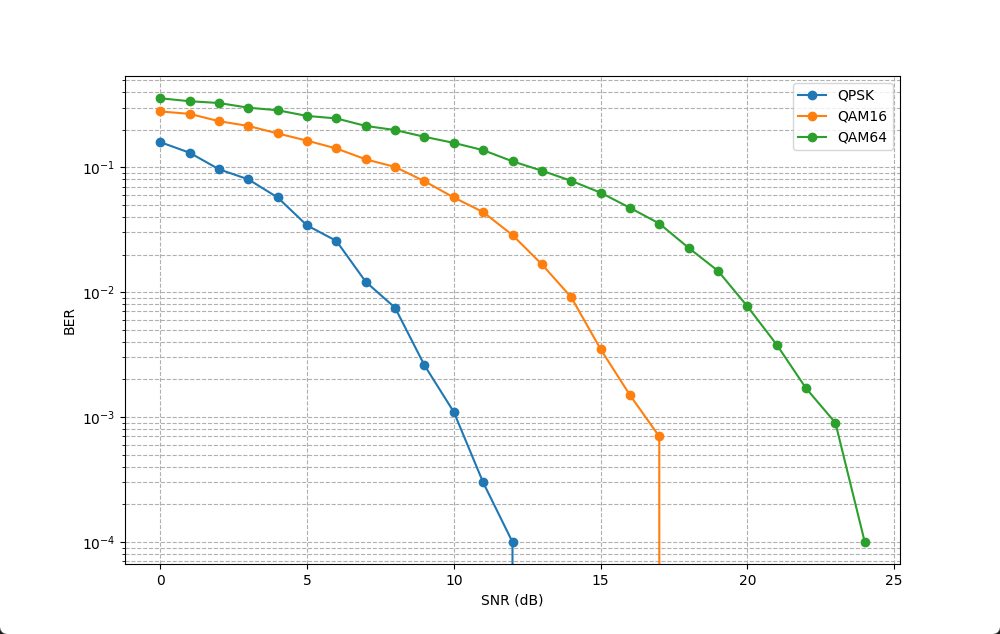

# yadro_t1

## Задание
Вариант 1
1. Написать на языке С++ класс, выполняющий функциональность модулятора QAM (QPSk, QAM16„ QAM64)
2. Написать на языке С++ класс, выполняющий функциональность добавления гауссовского шума к созвездию QAM
3. Написать на языке С++ класс, выполняющий функциональность демодулятора QAM (QPSk, QAM16, QAM64)
4. Написать последовательный вызов 1-З для случайной последовательности бит для разных значений дисперсия шума
5. Построить график зависимости вероятности ошибки на бит от дисперсии шума

## График
